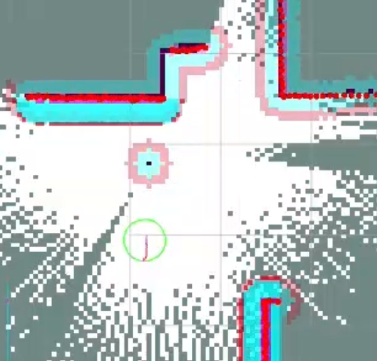
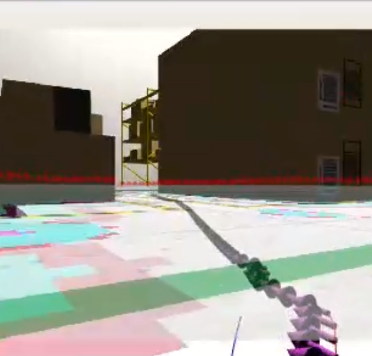
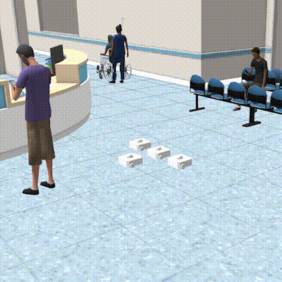

# Overview

<text style="font-size: 16px;">The system employs a Central Nervous System (LLM) to process textual inputs and issue commands to a scheduler, which optimizes task allocation and monitors robot states. The scheduler coordinates unit robots that autonomously perform tasks such as SLAM for mapping and localization, stereo depth sensing, and instance segmentation to generate a semantic map, which updates the map interpreter to inform the scheduler of environmental changes. The robots handle task-specific navigation, manipulation, and exploration, enabling dynamic and coordinated swarm navigation.
<p align="center">


<br>
Autonomous mapping of enviornment
</p>

<p align="center">


<br>
Autonomous Goal assignment and planning in swarm robots
</p>

# Installations

## ROS2-Humble & Gazebo Installation

<details open>


<summary style="font-size: 16px;"><b>1. To install ROS2-humble, open terminal and run the following commands</b></summary>

<br>

```bash
sudo apt update
sudo apt upgrade
```
</details>

<details>
<summary style="font-size: 16px;"><b>2. Set locale</b></summary>

<br>

```bash
locale  # check for UTF-8

sudo apt update && sudo apt install locales
sudo locale-gen en_US en_US.UTF-8
sudo update-locale LC_ALL=en_US.UTF-8 LANG=en_US.UTF-8
export LANG=en_US.UTF-8

locale  # verify settings
```
</details>

<details>
<summary style="font-size: 16px;"><b>3. Setup Sources</b></summary>

<br>

```bash
sudo apt install software-properties-common
sudo add-apt-repository universe
```
</details>


<details>
<summary style="font-size: 16px;"><b>4. Add ROS 2 GPG key</b></summary>

<br>

```bash
sudo apt update && sudo apt install curl -y
sudo curl -sSL https://raw.githubusercontent.com/ros/rosdistro/master/ros.key -o /usr/share/keyrings/ros-archive-keyring.gpg
```
</details>

<details>
<summary style="font-size: 16px;"><b>5. Add repository to sources</b></summary>

<br>

```bash
echo "deb [arch=$(dpkg --print-architecture) signed-by=/usr/share/keyrings/ros-archive-keyring.gpg] http://packages.ros.org/ros2/ubuntu $(. /etc/os-release && echo $UBUNTU_CODENAME) main" | sudo tee /etc/apt/sources.list.d/ros2.list > /dev/null
```
</details>

<details>
<summary style="font-size: 16px;"><b>6. Install ROS 2 packages</b></summary>

<br>

```bash
sudo apt update
sudo apt upgrade
```

```bash
sudo apt install ros-humble-desktop
sudo apt install ros-dev-tools
```
</details>

<details>
<summary style="font-size: 16px;"><b>7. Gazebo install</b></summary>

<br>

```bash
sudo apt install ros-humble-gazebo-ros
sudo apt install ros-humble-gazebo-ros-packages
```
</details>

<details>
<summary style="font-size: 16px;"><b>8. Enviornment setup</b></summary>

<br>

```bash
echo "source /opt/ros/humble/setup.bash" >> ~/.bashrc
```

</details>

<br>

## Extraction


<text style="font-size: 16px;">1\. Install unzip utility

```bash
sudo apt-get install unzip
```

<text style="font-size: 16px;">2\. Unzip the file in home directory

```bash
unzip ~/Downloads/Mobile-Swarm-Navigation.zip -d ~
```


<br>

## Building workspace


<text style="font-size: 16px;">1\. Install requirements

```bash
pip install -r requirements.txt
```
(Note: In case of numpy version mismatch run `pip install numpy==1.21.5`)

- Nav2 Install
```bash
sudo apt install ros-humble-navigation2
sudo apt install ros-humble-nav2-*
```
- SLAM Install
```bash
sudo apt install ros-humble-slam-toolbox
```

<text style="font-size: 16px;">2\. Set Gazebo Paths

- Export Turtlebot3 Model paths
```bash
echo "export GAZEBO_MODEL_PATH=$GAZEBO_MODEL_PATH:$HOME/Mobile-Swarm-Navigation/Team_53_ws/auto_explore/models" >>  ~/.bashrc
echo "export TURTLEBOT3_MODEL=waffle" >> ~/.bashrc
```
- Export World Models paths

```bash
echo "export GAZEBO_MODEL_PATH=$GAZEBO_MODEL_PATH:~/Mobile-Swarm-Navigation/Team_53_ws/aws-robomaker-hospital-world/models:$GAZEBO_MODEL_PATH" >> ~/.bashrc
echo "export GAZEBO_MODEL_PATH=$GAZEBO_MODEL_PATH:~/Mobile-Swarm-Navigation/Team_53_ws/aws-robomaker-hospital-world/fuel_models:$GAZEBO_MODEL_PATH" >> ~/.bashrc  
echo "export GAZEBO_MODEL_PATH=$GAZEBO_MODEL_PATH:~/Mobile-Swarm-Navigation/Team_53_ws/aws-robomaker-small-warehouse-world/models:$GAZEBO_MODEL_PATH" >> ~/.bashrc
echo "export GAZEBO_MODEL_PATH=$GAZEBO_MODEL_PATH:~/Mobile-Swarm-Navigation/Team_53_ws/turtlebot3_multi_robot/models:$GAZEBO_MODEL_PATH" >> ~/.bashrc
```

- Export Plugins paths
```bash
echo "export GAZEBO_PLUGIN_PATH=$GAZEBO_PLUGIN_PATH:~/Mobile-Swarm-Navigation/Team_53_ws/plugins" >> ~/.bashrc
```
<text style="font-size: 16px;">3\. Install dependencies

- <u>Note: The following installation may take some time (>5 mins) depending on the system.</u>

```bash
cd ~/Mobile-Swarm-Navigation/Team_53_ws/aws-robomaker-hospital-world/
rosdep install --from-paths . --ignore-src -r -y
chmod +x setup.sh
./setup.sh
cd ../../
colcon build
echo "source ~/Mobile-Swarm-Navigation/Team_53_ws/install/setup.bash" >> ~/.bashrc
```

<br>

# Deployment


<text style="font-size: 16px;">1\. Launch auto_explore package(manual):  
- It can be run through the the chatbot also by giving it a prompt to explore the environment.

```bash
cd ~/Mobile-Swarm-Navigation/Team53_ws/
ros2 launch auto_explore auto_map.launch.py
```

<text style="font-size: 16px;">2\. To save the map:

```bash
ros2 run nav2_map_server map_saver_cli -f ~/auto_explore/maps/map_new 
```

<text style="font-size: 16px;">3\. Running the chatbot:

```bash
python3 ~/Mobile-Swarm-Navigation/AI_ML_models/chatbot/app.py
```

<text style="font-size: 16px;">4\. Start Semantic mapping:

```bash
python3 ~/Mobile-Swarm-Navigation/Team_53_ws/semantic_mapper/semantic_mapper/semantic_mapper_launch.py --bot_name=<bot_i>   #Do this for each bot on which you want semantic mapping to happen 
#<bot_i> is the bot name where i can be from 0 to num_bots
```


<text style="font-size: 16px;">5\. Run the interpreter and Scheduler:

```bash
ros2 run interpreter interpreter
python3 ~/Mobile-Swarm-Navigation/Team_53_ws/scheduler/launch/scheduler_launch.py --num_bots= <number_of_robots>
```
<text style="font-size: 16px;">6\. Start the simulation:

```bash
python3 ~/Mobile-Swarm-Navigation/Team_53_ws/turtlebot3_multi_robot/launch/spawn_bots.py --num_bots=<number-of-robots> --x_pose =<space-separated-array> --y_pose =<space-separated-array>
```


<text style="font-size: 16px;">7\. Give task commands via chatbot 


<br>

# Directory Structure

```bash
$HOME
└── Mobile-Swarm-Navigation
    ├── AI_ML_models
    │   ├── chatbot
    │   ├── Instance_Segmentation_Model_YOLOv8-seg
    │   └── README.md
    ├── assets
    ├── README.md
    ├── requirements.txt
    ├── Videos
    ├── Mobile-Swarm-Navigation.pdf
    └── Team_53_ws
        ├── auto_explore
        ├── aws-robomaker-hospital-world
        ├── aws-robomaker-small-warehouse-world-ros2
        ├── explore_lite
        ├── frame_changer
        ├── interpreter
        ├── plugins
        ├── scheduler
        ├── semantic_mapper
        ├── turtlebot3
        └── turtlebot3_multi_robot

```

# How does it work
<text style="font-size: 16px;">The nervous system manages robot activities by assigning states—idle, exploration, or occupied—based on inputs from the Central Nervous System (LLM). Initially, one robot begins in exploration mode to map the environment, while others remain idle until instructed. Tasks are dynamically assigned to the nearest available robot, prioritizing efficiency while ensuring ongoing tasks are not disrupted. The swarm control system enables real-time data sharing among robots, allowing them to collaboratively build and update a global semantic map detailing the environment’s layout and key landmarks. Robots in occupied mode utilize this shared map to efficiently complete tasks, avoiding redundant efforts.

<u>For Further Details refer to individual package readme files</u>


## Demonstration
- Videos: [drive_link](https://drive.google.com/drive/folders/1R-KmugCW5OYquV0uMlaHNyM6oqgc6VKU?usp=sharing)
- Presentation: [canva_link](https://www.canva.com/design/DAGYiRrygrs/sYhHp51WUuve2WNG8jo0uA/edit?utm_content=DAGYiRrygrs&utm_campaign=designshare&utm_medium=link2&utm_source=sharebutton)

# Resources

<text style="font-size: 16px;">1\. Turtlebot3 Model<br>

-   https://github.com/ROBOTIS-GIT/turtlebot3.git

<text style="font-size: 16px;">2\. AWS RoboMaker Hospital gazebo world<br>

-   https://github.com/aws-robotics/aws-robomaker-hospital-world.git

<text style="font-size: 16px;">3\. AWS RoboMaker Small Warehouse gazebo world<br>

-   https://github.com/aws-robotics/aws-robomaker-small-warehouse-world.git

<text style="font-size: 16px;">4\. Nav2 Framework<br>

-   https://github.com/ros-navigation/navigation2.git

<text style="font-size: 16px;">5\. SLAM Toolbox<br>

-   https://github.com/SteveMacenski/slam_toolbox.git

<text style="font-size: 16px;">6\. M-Explore ROS2<br>

-   https://github.com/robo-friends/m-explore-ros2.git

<text style="font-size: 16px;">7\. Turtlebot3 Multi Robot<br>

-   https://github.com/arshadlab/turtlebot3_multi_robot.git

# Future Work
<text style="font-size: 16px">The system can feature Dynamic Map Merging, where robots collaboratively create a unified map, enabling faster mapping while dynamically updating it as environments change. A Robotic Arm can be integrated with the central system to autonomously retrieve coordinates from the semantic map and perform tasks independently. Additionally, Swarm Map Exploration allows robots to collaboratively navigate and explore unknown environments, ensuring efficient coverage and adaptability to dynamic conditions.<br>


# Notes

<text style="font-size: 16px">This project was built and tested on a system with following specifications:

 - Intel Core i7-12650H Processor
 - 16GB RAM
 - Nvidia RTX 4060 Laptop GPU - 8GB VRAM
 - NVIDIA Driver 535.183.01
 - NVIDIA CUDA Toolkit 12.2
 - OS: Ubuntu 22.04 LTS
 - ROS2 Humble
 - Gazebo Classic
 - Python 3.10.12

