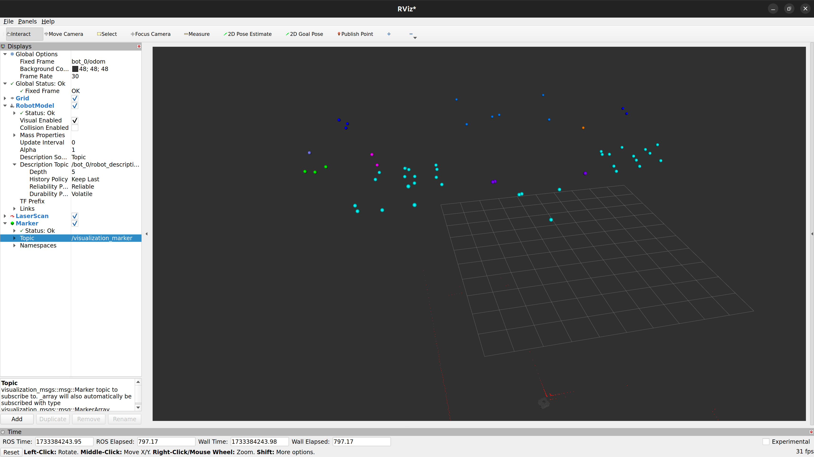

# Semantic Mapper

## Overview

**Key Features**

1. **SemanticObject Class**
- Represents detected objects with:
  - 3D positions in different frames (odom, depth).
  - Object class information (class_id).
  - Lifespan management (e.g., how long the object is "alive").
  - Visualization via ROS2 Marker.
2. **SemanticDB Class**:

- Manages a database of detected objects:
  - Avoids duplicates by comparing positions and class IDs.
  - Writes object data to a CSV file.
  - Publishes marker messages for visualization in tools like RViz.
3. **SemanticMapper Node**:

- The core ROS2 node responsible for:
  - Subscribing to RGB, depth images, and camera info topics.
  - Performing inference using a YOLO model to detect objects in RGB frames.
  - Calculating the 3D position of detected objects using depth information.
  - Transforming object coordinates from the depth frame to the odometry frame (depth2odom_transform).
  - Adding new objects to the SemanticDB or updating existing objects.
  - Visualizing annotated frames with detected objects (debug mode).
  - Regularly cleaning up non-alive objects and publishing active markers.

---

### Package Structure

```plaintext
semantic_mapper/
├── config/
│   └── data.yaml                 
├── launch/
│   └── semantic_mapper.launch.py 
├── map/
│   └── semantic_database.csv     
├── scripts/
│   └── semantic_mapper_node.py   
├── weights/
│   └── best.pt                   
├── setup.py                      
├── package.xml                   
├── README.md                    
└── CMakeLists.txt                
```

---

### **Deployment**
Launch the world

Run Semantic Mapper Node
   ```bash
   ros2 run semantic_mapper semantic_mapper
   ```

   (Note: Verify the frames and topic names used for transforms and subscriptions inside the *semantic_database.py*)

   

## Results

#### **Semantic Mapper Visualization**
- **3D point cloud**  
  

